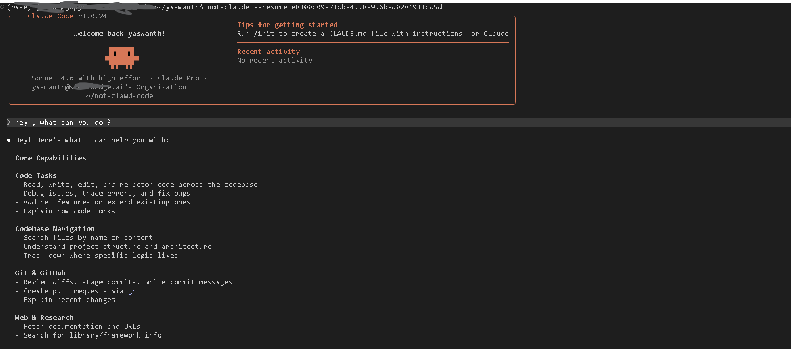

# not_clawd_code

`not_clawd_code` is a reconstructed local build of the publicly exposed Claude Code source snapshot from March 31, 2026. The original public leak exposed an incomplete `src/` tree. This repository was later rebuilt into a runnable Bun project by restoring missing root files, adding compatibility shims, reconstructing missing source/runtime pieces, and patching runtime gaps.

This is not an official Anthropic release.

## Current Status

The current local tree is able to start the interactive CLI again.

Verified in this workspace:

```bash
bun install
bun run version
bun run dev
bun run build
```

Current package metadata:

- `name`: `not_clawd_code`
- `version`: `1.0.24`
- `packageManager`: `bun@1.3.5`
- `engines.bun`: `>=1.1.0`

Verified local Bun version:

- `bun 1.3.11`

Interactive proof:



## What Was Reconstructed

The leaked source snapshot was not originally a complete runnable repository. This working tree now includes:

- restored root build files such as `package.json`, `tsconfig.json`, `bunfig.toml`, `bun.lock`, and `scripts/`
- reconstructed source/runtime pieces needed to complete the partial snapshot
- local compatibility packages under `shims/` for internal or unavailable modules
- extra runtime/vendor material under `vendor/`
- compatibility patches needed to make the interactive CLI start again under Bun

As checked in this workspace:

- `src/` currently contains `2047` files
- `node_modules` is symlinked to `/home/jovyan/shared/claude-code-build/node_modules`
- `dist` is symlinked to `/home/jovyan/shared/claude-code-build/dist`

## Project Structure

Current top-level layout in this reconstructed tree:

```text
.
├── src/                   # Restored TypeScript source tree
├── scripts/               # Build, packaging, install, and test helpers
├── shims/                 # Local compatibility packages for missing/internal modules
├── vendor/                # Native/runtime support sources
├── media/                 # Local media assets
├── package.json           # Package metadata and scripts
├── bun.lock               # Bun lockfile
├── bunfig.toml            # Bun preload configuration
├── tsconfig.json          # TypeScript config
```

Important source areas:

```text
src/
├── entrypoints/           # CLI bootstraps and SDK entrypoints
├── main.tsx               # Main CLI setup path
├── dev-entry.ts           # Reconstructed interactive dev launcher
├── QueryEngine.ts         # Core query/runtime loop
├── commands/              # Slash command implementations
├── tools/                 # Tool implementations
├── components/            # React + Ink terminal UI
├── services/              # Auth, MCP, telemetry, config, compact, etc.
├── bridge/                # IDE / remote-control bridge logic
├── coordinator/           # Multi-agent orchestration
├── tasks/                 # Task system
├── skills/                # Bundled skill logic
├── plugins/               # Plugin support
├── server/                # Server-side / IDE service entrypoints
├── remote/                # Remote session features
├── memdir/                # Persistent memory features
├── keybindings/           # Keyboard handling
├── vim/                   # Vim mode
├── ink/                   # Ink renderer integration
├── utils/                 # Shared helpers
└── types/                 # Shared types
```

## Toolchain And Runtime

This repo is a Bun-first TypeScript CLI project.

- entrypoint: `src/entrypoints/cli.tsx`
- interactive dev entry: `src/dev-entry.ts`
- Bun preload config: `bunfig.toml` preloads `scripts/bun-plugin-shims.ts`
- build output: `dist/cli.mjs`

Important runtime pieces in the current reconstruction:

- `react ^19.0.0`
- `react-reconciler ^0.33.0`
- `ink ^6.8.0`
- local file dependencies for internal modules such as:
  - `@ant/claude-for-chrome-mcp`
  - `@ant/computer-use-input`
  - `@ant/computer-use-mcp`
  - `@ant/computer-use-swift`
  - `color-diff-napi`
  - `modifiers-napi`
  - `url-handler-napi`

## Install And Run

From the repo root:

```bash
bun install
bun run version
bun run dev
```

Other useful commands:

```bash
bun run build
bun run start
bun run check
bun run test
```

In this workspace there is also an external helper launcher:

```bash
not-claude
```

That launcher is only a convenience wrapper around this repo. The repo-native command is still:

```bash
bun run dev
```

## Research Context

This repository exists for educational use, defensive security research, software supply-chain analysis, and architecture study. It should not be treated as an official Anthropic repository or an authoritative release artifact.

The current local state is a reconstruction. It is usable, but it may still differ from Anthropic's original internal repository in structure, history, packaging, and exact runtime behavior.

## Maintainer

- Yaswanth-ampolu
- `ampoluyaswanth2002@gmail.com`
